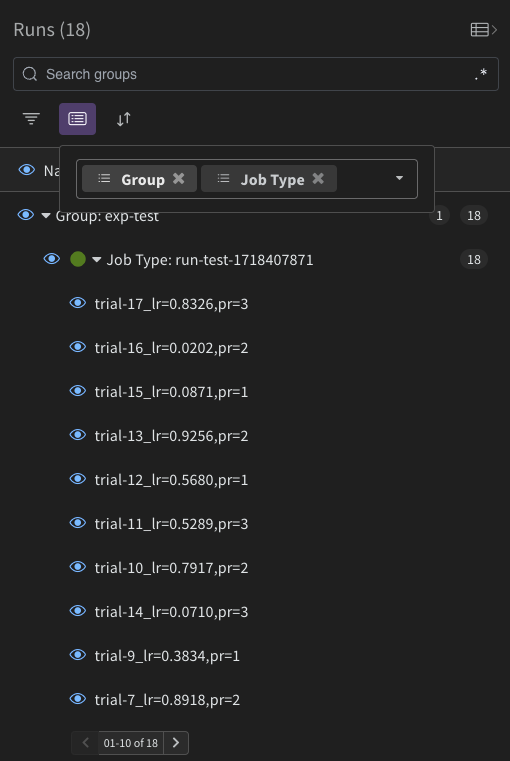

# Speeder: Accelerated ImageNet with Ray

## Data Pipeline Parallelism (DPP)
Speeder uses RayData to do distributed data preprocessing on the CPU at training time with data prefetching

## Distributed Data Parallelism (DDP)
Speeder uses RayTrain to do distributed data parallelism to train models on multiple GPUs at once

## Fast Hyperparameter Tuning
Speeder uses RayTune to do intelligent hyperparameter sweeps in parallel

# Quickstart

```
conda env create -y -n speeder -f env.yaml
conda activate speeder
python speeder/train.py
```

You can modify parameters directly in `configs/train_cfg.yaml`

For launching runs, you can specify a parameter override path to override select defaults like so:
```
python speeder/train.py overrides=<path_to_your_overrides_yaml>
```
See the `overrides` directory for examples

# WandB

1. Make a `.env` from `.env.template` and add your WandB API key

2. Group by `group` and `job_type` in the WandB dashboard to properly organize
    - The organization hierarchy is `experiment` -> `run` -> `trial`

